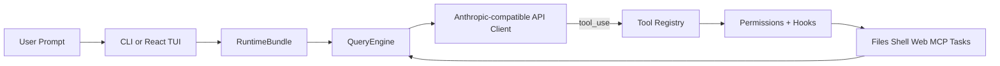

<h1 align="center">&nbsp; <code>oh</code> — OpenHarness: Open Agent Harness</h1>

**OpenHarness** delivers core lightweight agent infrastructure: tool-use, skills, memory, and multi-agent coordination.

**Join the community**: contribute **Harness** for open agent development.

<p align="center">
  <a href="#-quick-start"></a>
  <a href="#-harness-architecture"></a>
  <a href="#-features"></a>
  <a href="#-test-results"></a>
  <a href="LICENSE"></a>
</p>

<p align="center">
  
  
  
  
  
  <a href="https://github.com/HKUDS/OpenHarness/actions/workflows/ci.yml"></a>
  <a href="https://github.com/HKUDS/.github/blob/main/profile/README.md"></a>
  <a href="https://github.com/HKUDS/.github/blob/main/profile/README.md"></a>
</p>

One Command (**oh**) to Launch **OpenHarness** and Unlock All Agent Harnesses. 

Supports CLI agent integration including OpenClaw, nanobot, Cursor, and more.

<p align="center">
  
</p>

<p align="center">
  
</p>

---
## ✨ OpenHarness's Key Harness Features

<table align="center" width="100%">
<tr>
<td width="20%" align="center" style="vertical-align: top; padding: 15px;">

<h3>🔄 Agent Loop</h3>

<div align="center">
  
</div>


<p align="center"><strong>• Streaming Tool-Call Cycle</strong></p>
<p align="center"><strong>• API Retry with Exponential Backoff</strong></p>
<p align="center"><strong>• Parallel Tool Execution</strong></p>
<p align="center"><strong>• Token Counting & Cost Tracking</strong></p>

</td>
<td width="20%" align="center" style="vertical-align: top; padding: 15px;">

<h3>🔧 Harness Toolkit</h3>

<div align="center">
  
</div>


<p align="center"><strong>• 43 Tools (File, Shell, Search, Web, MCP)</strong></p>
<p align="center"><strong>• On-Demand Skill Loading (.md)</strong></p>
<p align="center"><strong>• Plugin Ecosystem (Skills + Hooks + Agents)</strong></p>
<p align="center"><strong>• Compatible with anthropics/skills & plugins</strong></p>

</td>
<td width="20%" align="center" style="vertical-align: top; padding: 15px;">

<h3>🧠 Context & Memory</h3>

<div align="center">
  
</div>


<p align="center"><strong>• CLAUDE.md Discovery & Injection</strong></p>
<p align="center"><strong>• Context Compression (Auto-Compact)</strong></p>
<p align="center"><strong>• MEMORY.md Persistent Memory</strong></p>
<p align="center"><strong>• Session Resume & History</strong></p>

</td>
<td width="20%" align="center" style="vertical-align: top; padding: 15px;">

<h3>🛡️ Governance</h3>

<div align="center">
  
</div>


<p align="center"><strong>• Multi-Level Permission Modes</strong></p>
<p align="center"><strong>• Path-Level & Command Rules</strong></p>
<p align="center"><strong>• PreToolUse / PostToolUse Hooks</strong></p>
<p align="center"><strong>• Interactive Approval Dialogs</strong></p>

</td>
<td width="20%" align="center" style="vertical-align: top; padding: 15px;">

<h3>🤝 Swarm Coordination</h3>

<div align="center">
  
</div>


<p align="center"><strong>• Subagent Spawning & Delegation</strong></p>
<p align="center"><strong>• Team Registry & Task Management</strong></p>
<p align="center"><strong>• Background Task Lifecycle</strong></p>
<p align="center"><strong>• <a href="https://github.com/HKUDS/ClawTeam">ClawTeam</a> Integration (Roadmap)</strong></p>

</td>
</tr>
</table>

---

## 🚀 44x Lighter Than Claude Code

<table>
<tr><th></th><th>Claude Code</th><th>OpenHarness</th></tr>
<tr><td><strong>Lines of Code</strong></td><td>512,664</td><td><strong>11,733</strong> (44x lighter)</td></tr>
<tr><td><strong>Files</strong></td><td>1,884</td><td><strong>163</strong></td></tr>
<tr><td><strong>Language</strong></td><td>TypeScript</td><td>Python</td></tr>
<tr><td><strong>Tools</strong></td><td>~44</td><td>43 (98%)</td></tr>
<tr><td><strong>Commands</strong></td><td>~88</td><td>54 (61%)</td></tr>
<tr><td><strong>Skills Compatible</strong></td><td>✅</td><td>✅ anthropics/skills</td></tr>
<tr><td><strong>Plugin Compatible</strong></td><td>✅</td><td>✅ claude-code/plugins</td></tr>
<tr><td><strong>Tests</strong></td><td>—</td><td>114 unit + 6 E2E suites</td></tr>
</table>

Leverages Python's power with pure focus on Harness architecture—stripped of enterprise overhead like telemetry, OAuth complexity, and hundreds of React components.

---

## 🤔 What is an Agent Harness?

An **Agent Harness** is the complete infrastructure that wraps around an LLM to make it a functional agent. The model provides intelligence; the harness provides **hands, eyes, memory, and safety boundaries**.

<p align="center">
  
</p>

OpenHarness is an open-source Python implementation designed for **researchers, builders, and the community**:

- **Understand** how production AI agents work under the hood
- **Experiment** with cutting-edge tools, skills, and agent coordination patterns
- **Extend** the harness with custom plugins, providers, and domain knowledge
- **Build** specialized agents on top of proven architecture

---

## 📰 What's New

- **2026-04-01** 🎨 **v0.1.0** — Initial **OpenHarness** open-source release featuring complete Harness architecture: 

<p align="center">
  <strong>Start here:</strong>
  <a href="#-quick-start">Quick Start</a> ·
  <a href="#-provider-compatibility">Provider Compatibility</a> ·
  <a href="docs/SHOWCASE.md">Showcase</a> ·
  <a href="CONTRIBUTING.md">Contributing</a> ·
  <a href="CHANGELOG.md">Changelog</a>
</p>

---

## 🚀 Quick Start

### Prerequisites

- **Python 3.10+** and [uv](https://docs.astral.sh/uv/)
- **Node.js 18+** (optional, for the React terminal UI)
- An LLM API key

### One-Command Demo

```bash
ANTHROPIC_API_KEY=your_key uv run oh -p "Inspect this repository and list the top 3 refactors"
```

### Install & Run

```bash
# Clone and install
git clone https://github.com/HKUDS/OpenHarness.git
cd OpenHarness
uv sync --extra dev

# Example: use Kimi as the backend
export ANTHROPIC_BASE_URL=https://api.moonshot.cn/anthropic
export ANTHROPIC_API_KEY=your_kimi_api_key
export ANTHROPIC_MODEL=kimi-k2.5

# Launch
oh                    # if venv is activated
uv run oh             # without activating venv
```

<p align="center">
  
</p>

### Non-Interactive Mode (Pipes & Scripts)

```bash
# Single prompt → stdout
oh -p "Explain this codebase"

# JSON output for programmatic use
oh -p "List all functions in main.py" --output-format json

# Stream JSON events in real-time
oh -p "Fix the bug" --output-format stream-json
```

## 🔌 Provider Compatibility

OpenHarness currently detects and adapts to a small set of provider profiles in code. The table below is intentionally conservative and reflects the profiles implemented in `src/openharness/api/provider.py`.

| Provider profile | Detection signal | Auth kind | Voice mode | Notes |
|------------------|------------------|-----------|------------|-------|
| **Anthropic** | Default when no custom `ANTHROPIC_BASE_URL` is set | API key | Not wired in current build | Default Claude-oriented setup |
| **Moonshot / Kimi** | `ANTHROPIC_BASE_URL` contains `moonshot` or model starts with `kimi` | API key | Not wired in current build | Works through an Anthropic-compatible endpoint |
| **Vertex-compatible** | Base URL contains `vertex` or `aiplatform` | GCP | Not wired in current build | Good fit for Anthropic-style gateways on Vertex |
| **Bedrock-compatible** | Base URL contains `bedrock` | AWS | Not wired in current build | Intended for Bedrock-style deployments |
| **Generic Anthropic-compatible** | Any other explicit `ANTHROPIC_BASE_URL` | API key | Not wired in current build | Useful for proxies and internal gateways |

If you are evaluating cross-provider workflows or want a concrete demo path, start with Anthropic or the Kimi example above, then compare behavior against your own compatible endpoint.

---

## 🏗️ Harness Architecture

OpenHarness implements the core Agent Harness pattern with 10 subsystems:

```
openharness/
  engine/          # 🧠 Agent Loop — query → stream → tool-call → loop
  tools/           # 🔧 43 Tools — file I/O, shell, search, web, MCP
  skills/          # 📚 Knowledge — on-demand skill loading (.md files)
  plugins/         # 🔌 Extensions — commands, hooks, agents, MCP servers
  permissions/     # 🛡️ Safety — multi-level modes, path rules, command deny
  hooks/           # ⚡ Lifecycle — PreToolUse/PostToolUse event hooks
  commands/        # 💬 54 Commands — /help, /commit, /plan, /resume, ...
  mcp/             # 🌐 MCP — Model Context Protocol client
  memory/          # 🧠 Memory — persistent cross-session knowledge
  tasks/           # 📋 Tasks — background task management
  coordinator/     # 🤝 Multi-Agent — subagent spawning, team coordination
  prompts/         # 📝 Context — system prompt assembly, CLAUDE.md, skills
  config/          # ⚙️ Settings — multi-layer config, migrations
  ui/              # 🖥️ React TUI — backend protocol + frontend
```

### The Agent Loop

The heart of the harness. One loop, endlessly composable:

```python
while True:
    response = await api.stream(messages, tools)
    
    if response.stop_reason != "tool_use":
        break  # Model is done
    
    for tool_call in response.tool_uses:
        # Permission check → Hook → Execute → Hook → Result
        result = await harness.execute_tool(tool_call)
    
    messages.append(tool_results)
    # Loop continues — model sees results, decides next action
```

The model decides **what** to do. The harness handles **how** — safely, efficiently, with full observability.

### Harness Flow



---

## ✨ Features

### 🔧 Tools (43+)

| Category | Tools | Description |
|----------|-------|-------------|
| **File I/O** | Bash, Read, Write, Edit, Glob, Grep | Core file operations with permission checks |
| **Search** | WebFetch, WebSearch, ToolSearch, LSP | Web and code search capabilities |
| **Notebook** | NotebookEdit | Jupyter notebook cell editing |
| **Agent** | Agent, SendMessage, TeamCreate/Delete | Subagent spawning and coordination |
| **Task** | TaskCreate/Get/List/Update/Stop/Output | Background task management |
| **MCP** | MCPTool, ListMcpResources, ReadMcpResource | Model Context Protocol integration |
| **Mode** | EnterPlanMode, ExitPlanMode, Worktree | Workflow mode switching |
| **Schedule** | CronCreate/List/Delete, RemoteTrigger | Scheduled and remote execution |
| **Meta** | Skill, Config, Brief, Sleep, AskUser | Knowledge loading, configuration, interaction |

Every tool has:
- **Pydantic input validation** — structured, type-safe inputs
- **Self-describing JSON Schema** — models understand tools automatically
- **Permission integration** — checked before every execution
- **Hook support** — PreToolUse/PostToolUse lifecycle events

### 📚 Skills System

Skills are **on-demand knowledge** — loaded only when the model needs them:

```
Available Skills:
- commit: Create clean, well-structured git commits
- review: Review code for bugs, security issues, and quality
- debug: Diagnose and fix bugs systematically
- plan: Design an implementation plan before coding
- test: Write and run tests for code
- simplify: Refactor code to be simpler and more maintainable
- pdf: PDF processing with pypdf (from anthropics/skills)
- xlsx: Excel operations (from anthropics/skills)
- ... 40+ more
```

**Compatible with [anthropics/skills](https://github.com/anthropics/skills)** — just copy `.md` files to `~/.openharness/skills/`.

### 🔌 Plugin System

**Compatible with [claude-code plugins](https://github.com/anthropics/claude-code/tree/main/plugins)**. Tested with 12 official plugins:

| Plugin | Type | What it does |
|--------|------|-------------|
| `commit-commands` | Commands | Git commit, push, PR workflows |
| `security-guidance` | Hooks | Security warnings on file edits |
| `hookify` | Commands + Agents | Create custom behavior hooks |
| `feature-dev` | Commands | Feature development workflow |
| `code-review` | Agents | Multi-agent PR review |
| `pr-review-toolkit` | Agents | Specialized PR review agents |

```bash
# Manage plugins
oh plugin list
oh plugin install <source>
oh plugin enable <name>
```

### 🤝 Ecosystem Workflows

OpenHarness is useful as a lightweight harness layer around Claude-style tooling conventions:

- **OpenClaw-oriented workflows** can reuse Markdown-first knowledge and command-driven collaboration patterns.
- **Claude-style plugins and skills** stay portable because OpenHarness keeps those formats familiar.
- **ClawTeam-style multi-agent work** maps well onto the built-in team, task, and background execution primitives.

For concrete usage ideas instead of generic claims, see [`docs/SHOWCASE.md`](docs/SHOWCASE.md).

### 🛡️ Permissions

Multi-level safety with fine-grained control:

| Mode | Behavior | Use Case |
|------|----------|----------|
| **Default** | Ask before write/execute | Daily development |
| **Auto** | Allow everything | Sandboxed environments |
| **Plan Mode** | Block all writes | Large refactors, review first |

**Path-level rules** in `settings.json`:
```json
{
  "permission": {
    "mode": "default",
    "path_rules": [{"pattern": "/etc/*", "allow": false}],
    "denied_commands": ["rm -rf /", "DROP TABLE *"]
  }
}
```

### 🖥️ Terminal UI

React/Ink TUI with full interactive experience:

- **Command picker**: Type `/` → arrow keys to select → Enter
- **Permission dialog**: Interactive y/n with tool details
- **Mode switcher**: `/permissions` → select from list
- **Session resume**: `/resume` → pick from history
- **Animated spinner**: Real-time feedback during tool execution
- **Keyboard shortcuts**: Shown at the bottom, context-aware

### 📡 CLI

```
oh [OPTIONS] COMMAND [ARGS]

Session:     -c/--continue, -r/--resume, -n/--name
Model:       -m/--model, --effort, --max-turns
Output:      -p/--print, --output-format text|json|stream-json
Permissions: --permission-mode, --dangerously-skip-permissions
Context:     -s/--system-prompt, --append-system-prompt, --settings
Advanced:    -d/--debug, --mcp-config, --bare

Subcommands: oh mcp | oh plugin | oh auth
```

---

## 📊 Test Results

| Suite | Tests | Status |
|-------|-------|--------|
| Unit + Integration | 114 | ✅ All passing |
| CLI Flags E2E | 6 | ✅ Real model calls |
| Harness Features E2E | 9 | ✅ Retry, skills, parallel, permissions |
| React TUI E2E | 3 | ✅ Welcome, conversation, status |
| TUI Interactions E2E | 4 | ✅ Commands, permissions, shortcuts |
| Real Skills + Plugins | 12 | ✅ anthropics/skills + claude-code/plugins |

```bash
# Run all tests
uv run pytest -q                           # 114 unit/integration
python scripts/test_harness_features.py     # Harness E2E
python scripts/test_real_skills_plugins.py  # Real plugins E2E
```

---

## 🔧 Extending OpenHarness

### Add a Custom Tool

```python
from pydantic import BaseModel, Field
from openharness.tools.base import BaseTool, ToolExecutionContext, ToolResult

class MyToolInput(BaseModel):
    query: str = Field(description="Search query")

class MyTool(BaseTool):
    name = "my_tool"
    description = "Does something useful"
    input_model = MyToolInput

    async def execute(self, arguments: MyToolInput, context: ToolExecutionContext) -> ToolResult:
        return ToolResult(output=f"Result for: {arguments.query}")
```

### Add a Custom Skill

Create `~/.openharness/skills/my-skill.md`:

```markdown
---
name: my-skill
description: Expert guidance for my specific domain
---

# My Skill

## When to use
Use when the user asks about [your domain].

## Workflow
1. Step one
2. Step two
...
```

### Add a Plugin

Create `.openharness/plugins/my-plugin/.claude-plugin/plugin.json`:

```json
{
  "name": "my-plugin",
  "version": "1.0.0",
  "description": "My custom plugin"
}
```

Add commands in `commands/*.md`, hooks in `hooks/hooks.json`, agents in `agents/*.md`.

---

## 🌍 Showcase

OpenHarness is most useful when treated as a small, inspectable harness you can adapt to a real workflow:

- **Repo coding assistant** for reading code, patching files, and running checks locally.
- **Headless scripting tool** for `json` and `stream-json` output in automation flows.
- **Plugin and skill testbed** for experimenting with Claude-style extensions.
- **Multi-agent prototype harness** for task delegation and background execution.
- **Provider comparison sandbox** across Anthropic-compatible backends.

See [`docs/SHOWCASE.md`](docs/SHOWCASE.md) for short, reproducible examples.

---

## 🤝 Contributing

OpenHarness is a **community-driven research project**. We welcome contributions in:

| Area | Examples |
|------|---------|
| **Tools** | New tool implementations for specific domains |
| **Skills** | Domain knowledge `.md` files (finance, science, DevOps...) |
| **Plugins** | Workflow plugins with commands, hooks, agents |
| **Providers** | Support for more LLM backends (OpenAI, Ollama, etc.) |
| **Multi-Agent** | Coordination protocols, team patterns |
| **Testing** | E2E scenarios, edge cases, benchmarks |
| **Documentation** | Architecture guides, tutorials, translations |

```bash
# Development setup
git clone https://github.com/HKUDS/OpenHarness.git
cd OpenHarness
uv sync --extra dev
uv run pytest -q  # Verify everything works
```

Useful contributor entry points:

- [`CONTRIBUTING.md`](CONTRIBUTING.md) for setup, checks, and PR expectations
- [`CHANGELOG.md`](CHANGELOG.md) for user-visible changes
- [`docs/SHOWCASE.md`](docs/SHOWCASE.md) for real-world usage patterns worth documenting

---

## 📄 License

MIT — see [LICENSE](LICENSE).

---

<p align="center">
  
  <br>
  <strong>Oh my Harness!</strong>
  <br>
  <em>The model is the agent. The code is the harness.</em>
</p>

<p align="center">
  <em> Thanks for visiting ✨ OpenHarness!</em><br><br>
  
</p>
